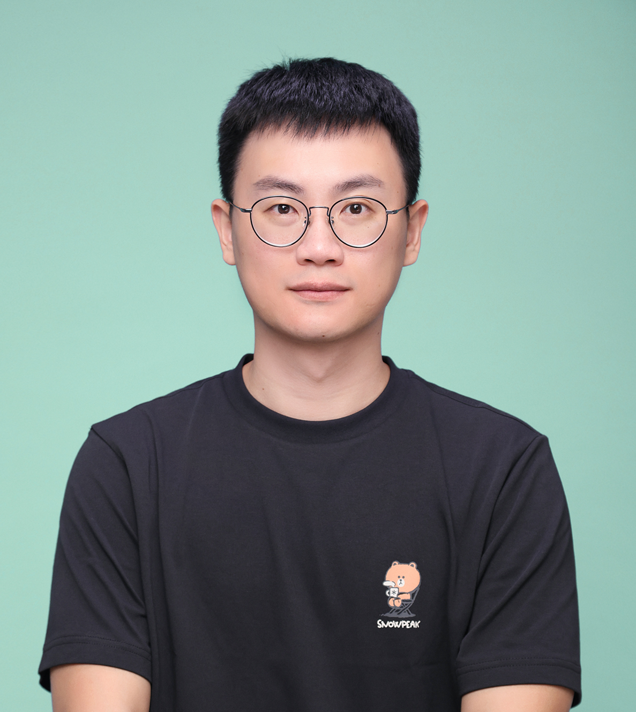
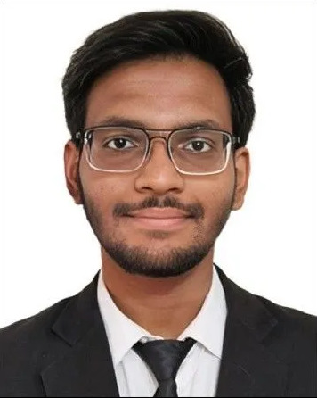
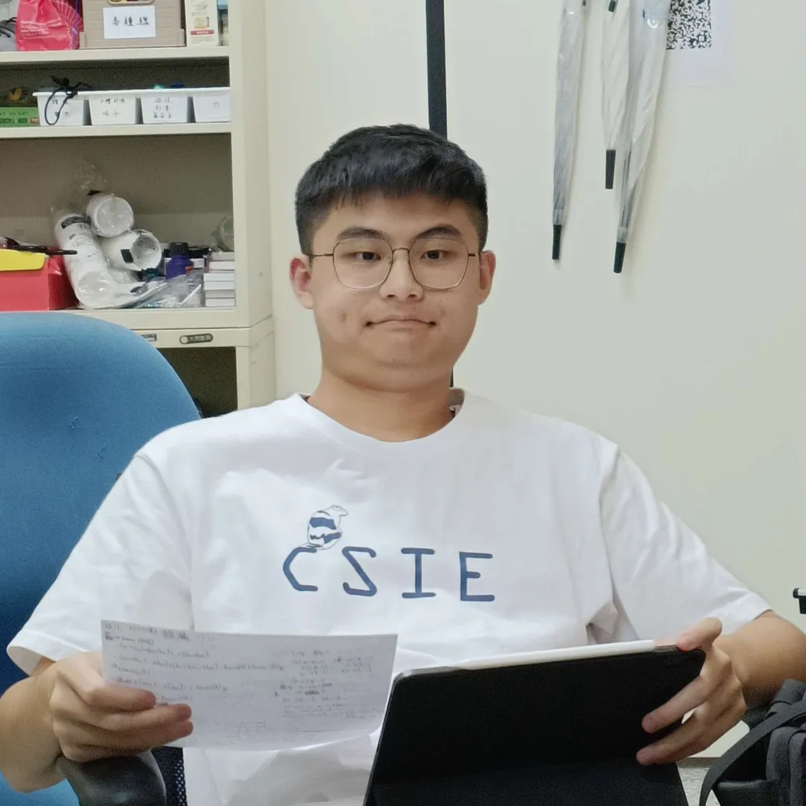
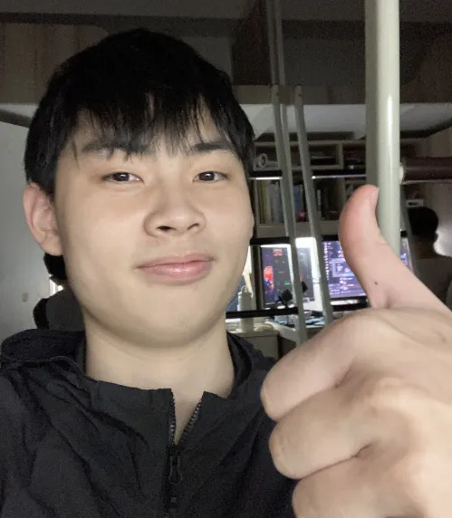
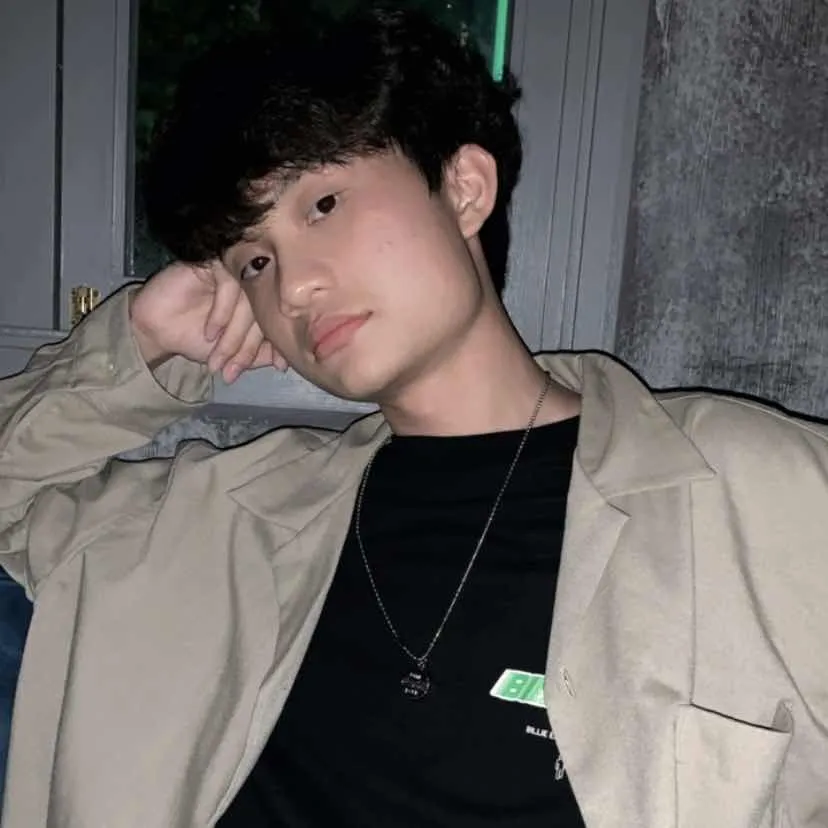

Welcome to the Computer Vision and Intelligence (CVI) lab! Here are the amazing individuals who make up our team:

---

## Principal Investigator

  
  <h3><strong>Jhih-Ciang Wu</strong></h3>

## MS Students

  

    
    
<strong>Devansh Saxena</strong>

  

---

## BS Students

  

    
    
<strong>I-Han Cho</strong>

  

  

    
    
<strong>Yu-Siang Huang</strong>

  

  

    
    
<strong>Yu-Chiao Cheng</strong>

  

---
